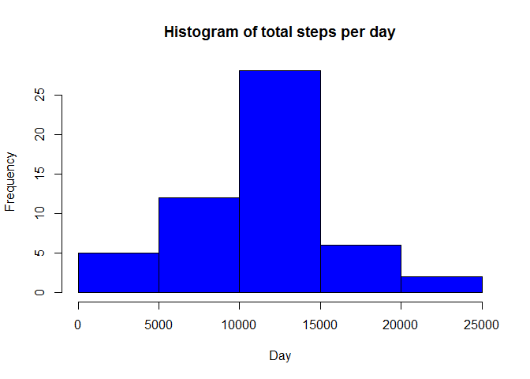
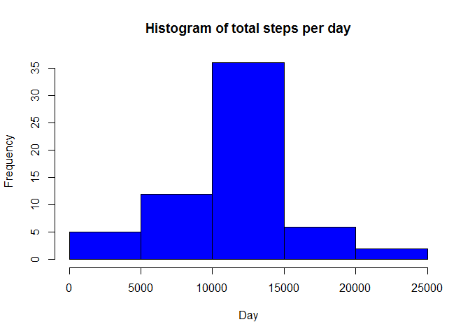

#Loading and preprocessing the data

```r
df <- read.csv("activity.csv", sep = ",", header = TRUE, na.strings = "NA")
names(df)
```

```
## [1] "steps"    "date"     "interval"
```

```r
head(df)
```

```
##   steps       date interval
## 1    NA 2012-10-01        0
## 2    NA 2012-10-01        5
## 3    NA 2012-10-01       10
## 4    NA 2012-10-01       15
## 5    NA 2012-10-01       20
## 6    NA 2012-10-01       25
```

#What is mean total number of steps taken per day?
1. Calculate the total number of steps taken per day using aggregate()

```r
TotalStepsPerDay <- aggregate(steps ~ date, data = df, sum, na.rm = TRUE)
```
2. Make a histogram of the total number of steps taken each day using hist()

```r
hist(TotalStepsPerDay$steps, col = "blue", main = "Histogram of total steps per day", xlab = "Day")
```

 

3. Calculate and report the mean and median of the total number of steps taken per day

```r
mean(TotalStepsPerDay$steps)
```

```
## [1] 10766.19
```

```r
median(TotalStepsPerDay$steps)
```

```
## [1] 10765
```

#What is the average daily activity pattern?
1. Make a time series plot (i.e. type = "l") of the 5-minute interval (x-axis) and the average number of steps taken, averaged across all days (y-axis) 

First, I create a new data frame with only "steps" and "interval" columns. Then I convert column "interval" to factor, so it can be used in tapply()

```r
m <- df[, c("steps", "interval")]
m$interval <- sapply(m$interval, as.factor) #
```

Then calculate time series of average steps by 5-min interval, then plot it

```r
AverageSteps <- tapply(m$steps, m$interval, mean, na.rm = TRUE)
```
Here is the plot function

```r
plot(row.names(AverageSteps), AverageSteps, 
     col = "blue", 
     type = "l", 
     main = "Average number of steps taken", 
     xlab = "5-min interval", 
     ylab = "Average across all Days")
```

 

2. Which 5-minute interval, on average across all the days in the dataset, contains the maximum number of steps?

```r
names(which.max(AverageSteps))
```

```
## [1] "835"
```

#Imputing missing values
1. Calculate and report the total number of missing values in the dataset (i.e. the total number of rows with NAs)

```r
sum(is.na(df))
```

```
## [1] 2304
```
2. Devise a strategy for filling in all of the missing values in the dataset. The strategy does not need to be sophisticated. For example, you could use the mean/median for that day, or the mean for that 5-minute interval, etc.
3. Create a new dataset that is equal to the original dataset but with the missing data filled in.

I decided to do 2 strategies  
*a. Mean of steps for that day*  
- First, create a new dataset that is equal to the original dataset but with the missing data filled in.

```r
new_df <- df  # Create new data frame
```
- Second, get the mean of steps per day. Then loop thru it if there are NaN, convert it to 0 (means on that day there are no record)

```r
AverageStepsPerDay <- tapply(new_df$steps, new_df$date, mean, na.rm = TRUE)
for (i in 1:length(AverageStepsPerDay)){
  if (is.nan(AverageStepsPerDay[i]) == TRUE)
    AverageStepsPerDay[i] = 0       #if the mean of that day is NaN convert it to 0  
}
```
- Third, loop thru the date, if it is NA convert it to the mean of that date

```r
for (i in 1:nrow(new_df)){
  if(is.na(df[i,1]) == TRUE){
    new_df[i,1] = AverageStepsPerDay[as.character(new_df[i,2])]
  }
}
```
*b. Mean for that 5-min interval*  
- First, create a new dataset that is equal to the original dataset but with the missing data filled in.

```r
new_df2 <- df # Create new data frame
```
- Second, get the mean of steps per 5-min interval, then loop thru it if there are NaN, convert it to 0 (means on that day there are no record)

```r
AverageStepsPer5Min <- tapply(new_df2$steps, new_df2$interval, mean, na.rm = TRUE)
for (i in 1:length(AverageStepsPer5Min)){
  if (is.nan(AverageStepsPer5Min[i]) == TRUE)
    AverageStepsPer5Min[i] <- 0       #if the mean of that day is NaN convert it to 0  
}
```
- Third, loop thru the date, if it is NA convert it to the mean of that 5-min interval

```r
for (i in 1:nrow(new_df2)){
  if(is.na(new_df2[i,1]) == TRUE){
    new_df2[i,1] <- AverageStepsPer5Min[as.character(new_df2[i,3])]
  }
}
```

4. Make a histogram of the total number of steps taken each day and Calculate and report the mean and median total number of steps taken per day. Do these values differ from the estimates from the first part of the assignment? What is the impact of imputing missing data on the estimates of the total daily number of steps?


```r
TotalStepsPerDay2 <- aggregate(steps ~ date, data = new_df2, sum, na.rm = TRUE)
hist(TotalStepsPerDay2$steps, col = "blue", main = "Histogram of total steps per day", xlab = "Day")
```

 
Calcualte mean and median

```r
mean(TotalStepsPerDay2$steps)
```

```
## [1] 10766.19
```

```r
median(TotalStepsPerDay2$steps)
```

```
## [1] 10766.19
```
After replacing the missing values, the median changes from 10765 to 10766, mean values are still the same  

#Are there differences in activity patterns between weekdays and weekends?
1. Create a new factor variable in the dataset with two levels -- "weekday" and "weekend" indicating whether a given date is a weekday or weekend day.

```r
df$daylevel <- "NA" #initialize new daylevel column in df
for(i in 1:nrow(df)){
  day <- weekdays(as.Date(df[i,2])) #convert Date to Day(i.e Mon, Tues, etc.)
  
  #if day is either Saturday or Sunday -> its "Weekend", otherwise, "Weekday"
  if (day == "Saturday") {
    df[i,"daylevel"] <- "Weekend"
  } else if (day == "Sunday") {
    df[i,"daylevel"] <- "Weekend"
  } else {
    df[i,"daylevel"] <- "Weekday"
  }
}
df$daylevel <- as.factor(df$daylevel)
```
2. Make a panel plot containing a time series plot (i.e. type = "l") of the 5-minute interval (x-axis) and the average number of steps taken, averaged across all weekday days or weekend days (y-axis)

```r
AverageStepsByDayLevel <- aggregate(steps ~ interval + daylevel, data = df, mean)
library(lattice) #xyplot is in lattice package
```

```r
xyplot(steps ~ interval | daylevel, AverageStepsByDayLevel, 
       layout = c(1, 2), 
       type = "l", 
       xlab = "Interval", 
       ylab = "Number of steps")
```

 
